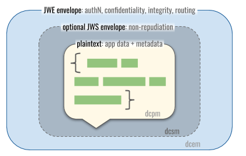
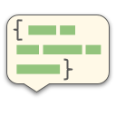
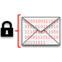

## Message Types

This specification discusses messages in three different formats. The casual phrase [DIDComm Messaging](.) is ambiguous, but usually refers to [DIDComm Messaging](.) encrypted messages (the outermost box in the diagram below). These will constitute the vast majority of network traffic in most [DIDComm Messaging](.) deployments, and they are responsible for security guarantees in the system. However, the role of encrypted messages cannot be understood without reference to the simpler formats they contain.



### Media Types

Media types are based on the conventions of [RFC6838](https://tools.ietf.org/html/rfc6838). Similar to [RFC7515](https://tools.ietf.org/html/rfc7515#section-4.1.9), the `application/` prefix MAY be omitted and the recipient MUST treat media types not containing `/` as having the `application/` prefix present.

### DIDComm Plaintext Messages

A [DIDComm Messaging](.) message in its plaintext form, not packaged into any protective envelope, is known as a **DIDComm plaintext message**. Plaintext messages lack confidentiality and integrity guarantees, and are repudiable. They are therefore not normally transported across security boundaries. However, this may be a helpful format to inspect in debuggers, since it exposes underlying semantics, and it is the format used in this specification to give examples of headers and other internals. Depending on ambient security, plaintext may or may not be an appropriate format for [DIDComm Messaging](.) data at rest.

When higher-level protocols are built atop [DIDComm Messaging](.), applications remove the protective envelope(s) and process the plaintext that's inside. Specifications for higher-level protocols typically document message structure and provide examples in this format; protective envelopes are assumed but ignored as a low-level detail.

The media type for a generic **DIDComm plaintext message** MUST be `application/didcomm-plain+json`. **DIDComm plaintext messages** are also correctly understood as [JWM](https://tools.ietf.org/html/draft-looker-jwm-01) content (see [Plaintext Message Structure](#plaintext-message-structure), below) and the media type MUST be set in the `typ` [property](https://tools.ietf.org/html/rfc7515#section-4.1.9) of the **DIDComm plaintext message** header.

When persisted as a file or attached as a payload in other contexts, the file extension for **DIDComm plaintext messages** SHOULD be `dcpm`, giving a globbing pattern of `*.dcpm`; this SHOULD be be read as "Star Dot D C P M" or as "D C P M" files. We imagine people will reference this media type by saying, "I am looking at a DIDComm Plaintext Message file", or "This database record is in DIDComm Plaintext format", or "Does my editor have a DIDComm Plaintext Message plugin?" A possible icon for this file format depicts green JSON text in a message bubble ([svg](../collateral/dcpm.svg) | [256x256](../collateral/dcpm-256.png) | [128x128](../collateral/dcpm-128.png) | [64x64](../collateral/dcpm-64.png)):



### DIDComm Signed Message

A **DIDComm signed message** is a signed [JWM (JSON Web Messages)](https://tools.ietf.org/html/draft-looker-jwm-01) envelope that associates a non-repudiable signature with the plaintext message inside it.

**DIDComm signed messages** are not necessary to provide message integrity (tamper evidence), or to prove the sender to the recipient. Both of these guarantees automatically occur with the authenticated encryption in **DIDComm encrypted messages**. **DIDComm signed messages** are only necessary when the origin of plaintext has to be provable to third parties, or when the sender can't be proven to the recipient by authenticated encryption because the recipient is not known in advance (e.g., in a broadcast scenario). Adding a signature when one is not needed [can degrade rather than enhance security because it relinquishes the sender's ability to speak off the record](https://github.com/hyperledger/aries-rfcs/blob/master/concepts/0049-repudiation/README.md#summary). We therefore expect **DIDComm signed messages** to be used in a few cases, but not as a matter of course.

When a message is *both* signed and encrypted, the plaintext is signed, and then the signed envelope is encrypted. The opposite order is not used, since it would imply that the signer committed to opaque data (which is unsafe and undermines non-repudiation).

The [media type](https://tools.ietf.org/html/rfc6838) of a **DIDComm signed message** MUST be `application/didcomm-signed+json`.

The media type of the envelope MUST be set in the `typ` [property](https://tools.ietf.org/html/rfc7515#section-4.1.9) of the JWS.

When persisted as a file or attached as a payload in other contexts, the file extension for **DIDComm signed messages** SHOULD be `dcsm`, giving a globbing pattern of `*.dcsm`; this SHOULD be be read as "Star Dot D C S M" or as "D C S M" files. A possible icon for this media type depicts a signed envelope ([svg](../collateral/dcsm.svg) | [256x256](../collateral/dcsm-256.png) | [128x128](../collateral/dcsm-128.png) | [64x64](../collateral/dcsm-64.png)):


### DIDComm Encrypted Message

A **DIDComm encrypted message** is an encrypted [JWM (JSON Web Messages)](https://tools.ietf.org/html/draft-looker-jwm-01) and hides its content from all but authorized recipients, discloses and proves the sender to exactly and only those recipients, and provides integrity guarantees. It is important in privacy-preserving routing. It is what normally moves over network transports in [DIDComm Messaging](.) applications, and is the safest format for storing [DIDComm Messaging](.) data at rest.

The [media type](https://tools.ietf.org/html/rfc6838) of a non-nested **DIDComm encrypted message** MUST be `application/didcomm-encrypted+json`.

> Note: If future versions of this spec allow binary encodings, variations like `application/didcomm-encrypted+cbor` (see [CBOR RFC 7049, section 7.5](https://tools.ietf.org/html/rfc7049#section-7.5)), `application/didcomm-encrypted+msgpack`, or `application/didcomm-encrypted+protobuf` may become reasonable. In the future, specifications that encompass communications patterns other than messaging &mdash; DIDComm Multicast or DIDComm Streaming, for example &mdash; might use a suffix: `application/didcomm-encrypted-multicast` or similar.

The media type of the envelope MUST be set in the `typ` [property](https://tools.ietf.org/html/rfc7516#section-4.1.11) of the JWE.

When persisted as a file or attached as a payload in other contexts, the file extension for **DIDComm encrypted messages** SHOULD be `dcem`, giving a globbing pattern of `*.dcem`; this SHOULD be read as "Star Dot D C E M" or as "D C E M" files. A possible icon for this file format depicts an envelope with binary overlay, protected by a lock ([svg](../collateral/dcem.svg) | [256x256](../collateral/dcem-256.png) | [128x128](../collateral/dcem-128.png) | [64x64](../collateral/dcem-64.png)):



## Plaintext Message Structure

**DIDComm plaintext messages** are based on [JWM (JSON Web Messages)](https://tools.ietf.org/html/draft-looker-jwm-01). A message has a basic structure that specifies the message type, id, and other attributes common to all messages. These common attributes appear at the top level of a **DIDComm plaintext message**, and are called headers. A **DIDComm plaintext message** also includes attributes specific to the message type. Type specific message attributes are contained within the `body` attribute of a **DIDComm plaintext message**.

Prior to being sent to a recipient, the [JWM](https://tools.ietf.org/html/draft-looker-jwm-01) is usually encrypted into a JWE according to the [JWM](https://tools.ietf.org/html/draft-looker-jwm-01) specification.

The following example shows common elements of a **DIDComm plaintext message**. Further details and advanced usage are covered elsewhere in this spec.

```json
{
  "typ": "application/didcomm-plain+json",
  "id": "1234567890",
  "type": "<message-type-uri>",
  "from": "did:example:alice",
  "to": ["did:example:bob"],
  "created_time": 1516269022,
  "expires_time": 1516385931,
  "body": {
    "messagespecificattribute": "and its value"
  }
}
```

### Message Headers

A **DIDComm plaintext message** conveys most of its application-level data inside a JSON `body` object that is a direct child of the message root. The structure inside `body` is predicted by the value of the message's `type` attribute, and varies according to the definition of the protocol-specific message in question. Each `type` of message will have its own `body`. 

However, some attributes are common to many different message types. When metadata about a message means the same thing regardless of context, and when it is susceptible to generic rather than message-specific handling, that metadata can be placed in **headers**. Headers are siblings of `body` and may be added to any message type. They are encrypted and decrypted along with `body` and therefore have an identical audience.

Headers in [DIDComm Messaging](.) are intended to be extensible in much the same way that headers in HTTP or SMTP are extensible. A few headers are predefined:

- **id** - REQUIRED. Message ID. The `id` attribute value MUST be unique to the sender.

- **type** - REQUIRED. Plaintext message type, useful for message handling in application-level protocols. The `type` attribute value MUST be a valid [Message Type URI](protocols.md#message-type-uri), that when resolved gives human readable information about the message. The attribute's value SHOULD predict the content in the `body` of the message.

- **typ** - OPTIONAL. Media type of the JWM content.

The following table provides an overview of using the media type properties in supported [DIDComm Messaging](.) messages:

| Envelope | `typ` |
|-----------------|-------|
| Authcrypted and/or anoncrypted | `application/didcomm-encrypted+json`|
| Signed and anoncrypted | `application/didcomm-encrypted+json`|
| Signed | `application/didcomm-signed+json` |
| Plaintext | `application/didcomm-plain+json`|

- **to** - OPTIONAL. Identifier(s) for recipients. MUST be an array of strings where each element is a valid [DID](https://www.w3.org/TR/did-core/) or [DID URL](https://w3c.github.io/did-core/#did-url-syntax) (without the [fragment component](https://w3c.github.io/did-core/#fragment)) that identifies a member of the message's intended audience. These values are useful for recipients to know which of their keys can be used for decryption. It is not possible for one recipient to verify that the message was sent to a different recipient.

When Alice sends the same message to Bob and Carol, it is by inspecting this header that Bob and Carol learn that the message was sent to both of them. If the header is omitted, each recipient can only assume they are the only recipient (much like an email sent only to `BCC:` addresses).

The `to` header cannot be used for routing, since it is encrypted at every intermediate point in a route. Instead, the `forward` message contains a `next` attribute in its body that specifies the target for the next routing operation.

- **from** - OPTIONAL when the message is to be encrypted via anoncrypt. REQUIRED when the message is encrypted via authcrypt. Sender identifier. The `from` attribute MUST be a string that is a valid [DID](https://w3c.github.io/did-core/) or [DID URL](https://w3c.github.io/did-core/#did-url-syntax) (without the [fragment component](https://w3c.github.io/did-core/#fragment)) which identifies the sender of the message. When a message is encrypted, the sender key MUST be authorized for encryption by this [DID](https://w3c.github.io/did-core/). Authorization of the encryption key for this [DID](https://w3c.github.io/did-core/) MUST be verified by message recipient with the proper proof purposes. When the sender wishes to remain anonymous, they should use a new, ephemeral DID. See the [message authentication](#Message-Authentication) section for additional details.

When the sender wishes to be anonymous using authcrypt, it is recommended to use a new [DID](https://w3c.github.io/did-core/) created for the purpose to avoid correlation with any other behavior or identity. Peer [DIDs](https://w3c.github.io/did-core/) are lightweight and require no ledger writes, and therefore a good method to use for this purpose.

- **thid** - OPTIONAL. Thread identifier. Uniquely identifies the thread that the message belongs to. If not included the `id` property of the message MUST be treated as the value of the `thid`.

- **pthid** - OPTIONAL. Parent thread identifier. If the message is a child of a thread the `pthid` will uniquely identify which thread is the parent.

- **created_time** - OPTIONAL. Message Created Time. The `created_time` attribute is used for the sender to express when they created the message, expressed in UTC Epoch Seconds (seconds since 1970-01-01T00:00:00Z UTC) [link](1970-01-01T00:00:00Z UTC). This attribute is informative to the recipient, and may be relied on by protocols.

- **expires_time** - OPTIONAL. Message Expired Time. The `expires_time` attribute is used for the sender to express when they consider the message to be expired, expressed in UTC Epoch Seconds (seconds since 1970-01-01T00:00:00Z UTC) [link](1970-01-01T00:00:00Z UTC). This attribute signals when the message is considered no longer valid by the sender. When omitted, the message is considered to have no expiration by the sender.

- **body** - REQUIRED. The `body` attribute contains all the message type specific attributes of the message type indicated in the `type` attribute. This attribute MUST be present, even if empty.

With respect to headers, [DIDComm Messaging](.) follows the extensibility pattern established by the JW* family of standards. A modest inventory of predefined "header" fields is specified, as shown above. Additional fields with unreserved names can be added at the discretion of producers and consumers of messages; any software that doesn't understand such fields SHOULD ignore them and MUST NOT fail because of their inclusion in a message. This is appropriate for a simple, flat data model.

Aligning with [RFC 6648](https://tools.ietf.org/html/rfc6648.html), [DIDComm Messaging](.) explicitly rejects the `X-*` headers convention that creates divergent pseudo-standards; if a new header needs broad support, proper standardization is required. Since we expect header fields to be small in number and modest in complexity, we expect this sort of powerful extensibility to be unnecessary in most cases.

#### Simple vs. Structured

Headers can be simple (mapping a header name to an integer or a string) or structured (mapping a header name to JSON substructure -- an array or JSON object). When defining a new header type, the following guidelines apply:

* Headers SHOULD NOT use more structure than necessary; simple headers are preferred.
* However, a header value SHOULD NOT require interpretation over and above ordinary JSON parsing. Prefer JSON structure to specialized string DSLs like the one that encodes media type preferences in an HTTP `Accept` header. ([HTTP Structured Headers](https://tools.ietf.org/html/draft-ietf-httpbis-header-structure-15) provide similar functionality but are unnecessary here, since **DIDComm plaintext messages** already has an easily parseable syntax.)
* Headers that are only meaningful together SHOULD be grouped into a JSON object.

#### Relationship to JSON-LD

The problem domain of [DIDComm Messaging](.) intersects with other aspects of decentralized identity, where JSON-LD plays a role in some standards. Thus it may be natural to wonder about [DIDComm Messaging's](.) relationship to JSON-LD and to the rich semantics and extensibility features it offers. The short answer is that [DIDComm Messaging](.) is not dependent on JSON-LD, but it is compatible with it. We expect these two technologies to remain mostly orthogonal.

The body of a message -- everything inside the `body` object -- is different. Here, there is substantial variety and complexity. Structures may be sophisticated graphs, represented with nested objects and arrays. JSON-LD is not required at this level, either. However, it is available, and may be appropriate for certain use cases where extensibility is an important feature. JSON-LD usage, if it occurs, SHOULD be a declared feature of a protocol as a whole, not an ad hoc extension to arbitrary individual messages, and MUST be signalled by the inclusion of a `@context` inside `body`. Unless a protocol declares a JSON-LD dependency, the same rules apply to JSON-LD-isms as apply to any other unrecognized structure in a [DIDComm Messaging](.) message: additional fields can be added to any part of message structure, SHOULD be ignored if not understood, and MUST NOT be the basis of failure by recipients.

### DID Rotation

[DIDComm Messaging](.) is based on [DIDs](https://www.w3.org/TR/did-core/) and their associated [DID Documents](https://www.w3.org/TR/did-core/#dfn-did-documents). Changes to keys and endpoints are the concern of each [DID](https://www.w3.org/TR/did-core/) method and are utilized but not managed by [DIDComm Messaging](.). [DID Rotation](#did-rotation) serves a very specific and narrow need to switch from one [DID](https://www.w3.org/TR/did-core/) method to another. This is very common at the beginning of a new [DIDComm Messaging](.) relationship when a public [DID](https://www.w3.org/TR/did-core/) or a temporary [DID](https://www.w3.org/TR/did-core/) passed unencrypted is rotated out for a [DID](https://www.w3.org/TR/did-core/) chosen for the relationship. As rotation between one [DID](https://www.w3.org/TR/did-core/) and another is outside the scope of any [DID](https://www.w3.org/TR/did-core/) method, the details of [DID Rotation](#did-rotation) are handled within [DIDComm Messaging](.) itself.

When a [DID](https://www.w3.org/TR/did-core/) is rotated, the new [DID](https://www.w3.org/TR/did-core/) is put into immediate use encrypting the message, and one additional attribute MUST be included as a message header:

- **from_prior**: REQUIRED. A JWT, with with `sub`: new [DID](https://www.w3.org/TR/did-core/) and `iss`: prior [DID](https://www.w3.org/TR/did-core/), with a signature from a key authorized by prior [DID](https://www.w3.org/TR/did-core/).

When a message is received from an unknown [DID](https://www.w3.org/TR/did-core/), the recipient SHOULD check for existence of the `from_prior` header. The JWT in the`from_prior` attribute is used to extract the prior [DID](https://www.w3.org/TR/did-core/) (`iss`) and is checked to verify the validity of the rotation. The recipient then associates the message with context related to the known sender. The new [DID](https://www.w3.org/TR/did-core/) and associated [DID](https://www.w3.org/TR/did-core/) Document information SHOULD be used for further communication.

The validity of the [DID Rotation](#did-rotation) is verified by checking the JWT signature against the key indicated in the `kid` header parameter. The indicated key MUST be authorized in the [DID Document](https://www.w3.org/TR/did-core/#dfn-did-documents) of the prior [DID](https://www.w3.org/TR/did-core/) (`iss`).

The `from_prior` attribute MUST be included in messages sent until the party rotating receives a message sent to the new [DID](https://www.w3.org/TR/did-core/). If multiple messages are received to containing the rotation headers after being processed by the recipient, they MAY be ignored.

#### JWT Details

The JWT is constructed as follows, with appropriate values changed.

**Header**:

```json
{
  "typ": "JWT",
  "alg": "EdDSA",
  "crv": "ED25519",
  "kid": "<key id authorized in prior DID>"
}
```

**Payload**:

```jsonc
{
  "sub": "<new DID URI>",
  "iss": "<prior DID URI>",
  "iat": 1516239022 //datetime of the rotation, not message
}
```

#### Example Message Rotating DID

```json
{
  "typ": "application/didcomm-plain+json",
  "id": "1234567890",
  "type": "<message-type-uri>",
  "from": "did:example:alice2",
  "from_prior": "<JWT with sub:did:example:alice2 and iss:did:example:alice>",
  "to": ["did:example:bob"],
  "created_time": 1516269022,
  "expires_time": 1516385931,
  "body": {
    "messagespecificattribute": "and its value"
  }
}
```

#### Rotation Limitations

- This rotation method does not cover cases where a multi-sig is required. Rotations with such requirements should use a more expressive protocol.

- This rotation method only supports the case where a new [DID](https://www.w3.org/TR/did-core/) is used, replacing an old [DID](https://www.w3.org/TR/did-core/) which is no longer used. Adjustments to [DIDs](https://www.w3.org/TR/did-core/) used between different parties that does not fit this narrow use are expected to define a separate protocol to do so.